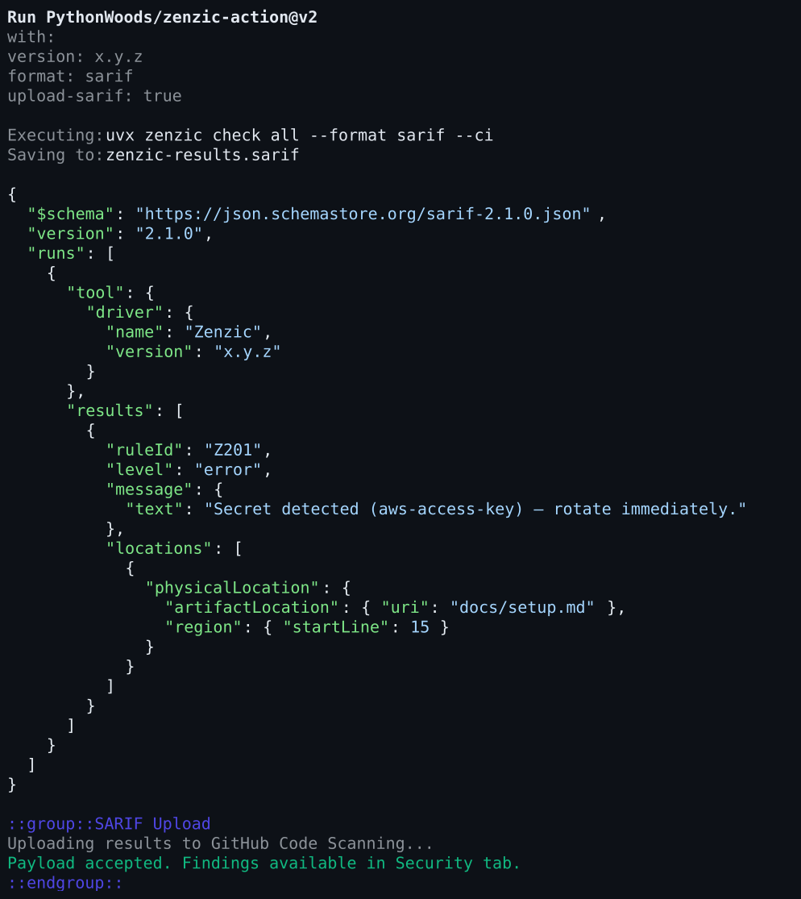

<!--
SPDX-FileCopyrightText: 2026 PythonWoods <dev@pythonwoods.dev>
SPDX-License-Identifier: Apache-2.0
-->

<p align="center">
  <a href="https://github.com/PythonWoods/zenzic-action">
    <picture>
      <source media="(prefers-color-scheme: dark)" srcset="./assets/zenzic-wordmark-action-dark.svg">
      <source media="(prefers-color-scheme: light)" srcset="./assets/zenzic-wordmark-action.svg">
      
    </picture>
  </a>
</p>

<p align="center">
  <strong>Deterministic Documentation Quality Platform (DQP) for GitHub Actions.</strong><br>
  <em>Enforce semantic correctness, topological link integrity, and credential safety on every pull request.</em>
</p>

<p align="center">
  <a href="https://github.com/PythonWoods/zenzic-action/actions/workflows/self-check.yml"></a>
  <!-- zenzic:audit-badge -->
  
  <!-- zenzic:score-badge -->
  
  <a href="https://github.com/PythonWoods/zenzic-action/releases"></a>
  <a href="https://pypi.org/project/zenzic"></a>
  <a href="LICENSE"></a>
  <a href="https://reuse.software/"></a>
</p>

---

## Documentation Quality Platform at the CI/CD Gate

Technical documentation is a continuously validated engineering asset. Broken links, orphaned pages, leaked API keys, and invalid metadata degrade developer trust and damage product integrity.

**`zenzic-action`** integrates the **Documentation Quality Platform (DQP)** into GitHub Actions workflows. It compiles and evaluates your documentation graph in seconds, blocks defective merges, and emits enriched SARIF v2.1.0 telemetry directly to GitHub Code Scanning.

---

## ⚡ Quick Start (< 60 Seconds)

Add this single workflow file to `.github/workflows/documentation-gate.yml`:

```yaml
name: Documentation Quality Gate

on:
  push:
    branches: [ main ]
  pull_request:
    branches: [ main ]

jobs:
  audit:
    name: Zenzic Document Integrity Gate
    runs-on: ubuntu-latest
    permissions:
      contents: read
      security-events: write  # Required for SARIF Code Scanning alerts

    steps:
      - name: Checkout Repository
        uses: actions/checkout@v4

      - name: Run Zenzic Static Analyzer
        uses: PythonWoods/zenzic-action@v2
        with:
          version: "0.30.0"
          format: "sarif"
          upload-sarif: "true"
```

*Zero toolchain configuration required. The action executes in an isolated environment via `uvx` and automatically leverages aggressive local caching—requiring zero manual `actions/cache` or Python environment setup.*

---

## 🎯 Immediate Benefits

Integrating Zenzic into your CI/CD workflow delivers immediate security, quality, and authoring guarantees:

### 1. Zero-Leak Security Enforcement
Hardcoded API keys, tokens, and credentials (`Z201`) immediately trigger **Exit Code 2**, halting the CI pipeline instantly. Security violations bypass all suppression budgets and cannot be overridden by `--exit-zero`.

### 2. Rich PR Annotations & Code Scanning
Findings are uploaded directly to **GitHub Code Scanning (SARIF v2.1.0)**. PR reviewers see actionable annotations on the exact line and file with remediation instructions—no digging through raw terminal logs.

<p align="center">
  
</p>

### 3. Full Topological & Semantic Validation
- **Broken Cross-References**: Detects dead links, missing image assets, and broken URL anchors across thousands of files in milliseconds.
- **Accessibility Checks**: Flags generic image alt text (`Z514`), malformed lists (`Z520`), and bare unformatted URLs (`Z515`).
- **Policy-as-Code Compliance**: Enforces required frontmatter (`Z610`), forbidden terms (`Z617`), and Zero-Trust domain whitelists (`Z614`).

### 4. Deterministic Quality Scoring (DQS)
Track your documentation health over time with mathematical rigor (0–100 score). Set hard quality gates (`fail_under = 90`) to maintain quality standards automatically.

---

## 🛠️ Action Configuration Reference

Configure all inputs and outputs for `zenzic-action` within your workflow definition:

### Inputs

| Input | Default | Description |
|:---|:---|:---|
| `version` | `0.30.0` | Exact Zenzic Core version to execute. Pin to a specific release for reproducible CI gates. |
| `working-directory` | `.` | Relative path to directory where Zenzic should run (useful for monorepos). |
| `format` | `sarif` | Output format: `sarif`, `text`, or `json`. |
| `sarif-file` | `zenzic-results.sarif` | Relative path inside the workspace for SARIF output. |
| `upload-sarif` | `true` | Upload SARIF results to GitHub Code Scanning (requires `security-events: write`). |
| `strict` | `false` | Exit non-zero on warnings as well as errors. |
| `fail-on-error` | `true` | Fail the workflow step if Zenzic detects quality errors. |
| `config-file` | `""` | Optional path to custom `.zenzic.toml` (auto-discovers root `.zenzic.toml` if omitted). |
| `audit` | `false` | Sovereign Audit mode: bypasses all inline suppressions to reveal unfiltered documentation graph state. |
| `guard-scan` | `false` | Run `zenzic guard scan` pre-check for credentials and forbidden patterns. Failures are fatal. |
| `check-stamp` | `true` | Verify documentation badge score freshness (`zenzic score --check-stamp`). |
| `generate_audit_report` | `false` | Generate formal compliance report (`zenzic-audit.json`) and upload as workflow artifact. |

### Outputs

| Output | Description |
| :--- | :--- |
| `score` | Documentation Quality Score (`0`–`100`). Available when format is `json` or `sarif`. |
| `sarif-file` | Path to the generated SARIF file. |
| `findings-count` | Total number of diagnostic findings reported. |
| `suppression-debt-pts` | Technical Debt points deducted from score due to active suppressions. |
| `cap-exceeded` | Set to `"true"` if the technical debt suppression cap was exceeded. |

---

## 📋 Ready-to-Use Workflow Blueprints

Select the appropriate integration pattern for your repository requirements:

### Blueprint 1: Strict Pull Request Quality Gate

Blocks PR merges if broken links are introduced or if the Documentation Quality Score drops below 95:

```yaml
name: Documentation PR Gate

on:
  pull_request:
    paths:
      - 'docs/**'
      - '.zenzic.toml'

jobs:
  quality-gate:
    runs-on: ubuntu-latest
    permissions:
      contents: read
      security-events: write

    steps:
      - uses: actions/checkout@v4

      - name: Verify Documentation Integrity
        uses: PythonWoods/zenzic-action@v2
        with:
          version: "0.30.0"
          strict: "true"
          fail-under: 95
          upload-sarif: "true"
```

### Blueprint 2: Nightly Sovereign Audit & Badge Generation

Performs an unsuppressed audit of your documentation graph and verifies status badge freshness:

```yaml
name: Nightly Documentation Audit

on:
  schedule:
    - cron: '0 3 * * *' # Every night at 3:00 AM UTC
  workflow_dispatch:

jobs:
  audit:
    runs-on: ubuntu-latest
    steps:
      - uses: actions/checkout@v4

      - name: Run Sovereign Audit
        uses: PythonWoods/zenzic-action@v2
        with:
          version: "0.30.0"
          audit: "true"
          format: "markdown"
```

### Blueprint 3: Monorepo Documentation Matrix

Run parallel, isolated documentation audits across multiple sub-projects or service directories using GitHub Actions `strategy.matrix` and `working-directory`:

```yaml
name: Monorepo Documentation Matrix Gate

on:
  pull_request:
    branches: [ main ]

jobs:
  audit-monorepo:
    name: Audit (${{ matrix.project.name }})
    runs-on: ubuntu-latest
    permissions:
      contents: read
      security-events: write
    strategy:
      fail-fast: false
      matrix:
        project:
          - name: "core-docs"
            path: "docs"
          - name: "frontend-docs"
            path: "services/frontend/docs"
          - name: "backend-api-docs"
            path: "services/backend/docs"

    steps:
      - uses: actions/checkout@v4

      - name: Verify Documentation Integrity
        uses: PythonWoods/zenzic-action@v2
        with:
          version: "0.30.0"
          working-directory: ${{ matrix.project.path }}
          upload-sarif: "true"
          sarif-file: "zenzic-${{ matrix.project.name }}.sarif"
```

---

## 📦 Unified Ecosystem

- **[Zenzic CLI (Core Engine)](https://github.com/PythonWoods/zenzic)**: Terminal scanner, AST parser, and atomic automated fixer (`zenzic fix`).
- **[Zenzic VS Code Extension](https://github.com/PythonWoods/zenzic-vscode)**: Real-time editor diagnostics, Quick Fixes, and inline DQS telemetry.
- **[Official Documentation](https://zenzic.dev)**: For deep architectural explanations, CI/CD blueprints, and the full finding taxonomy, visit [zenzic.dev](https://zenzic.dev).

---

## 📄 License

Licensed under the [Apache License, Version 2.0](LICENSE).
Copyright (c) 2026 PythonWoods `<dev@pythonwoods.dev>`.
